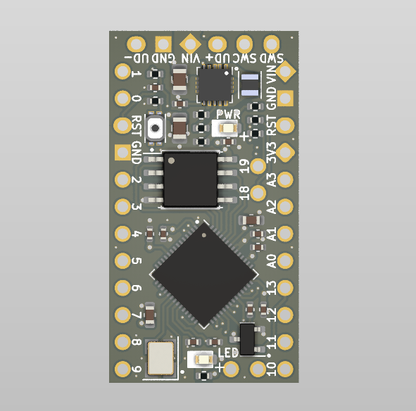
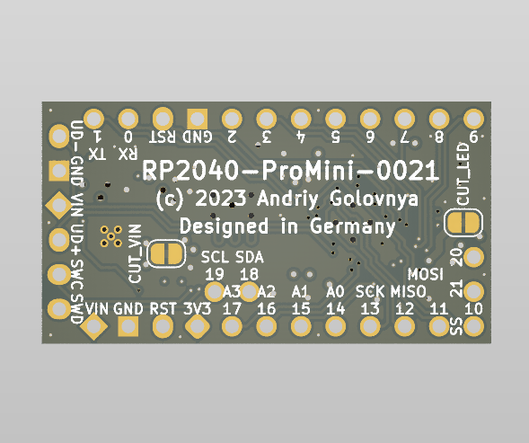
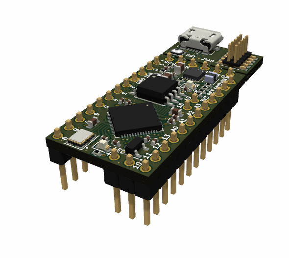
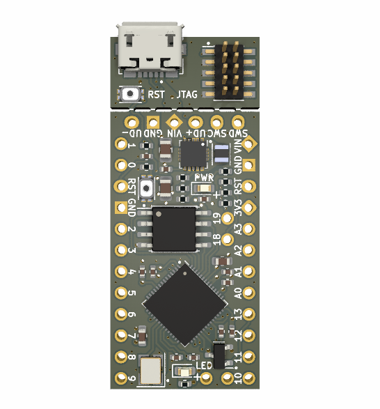
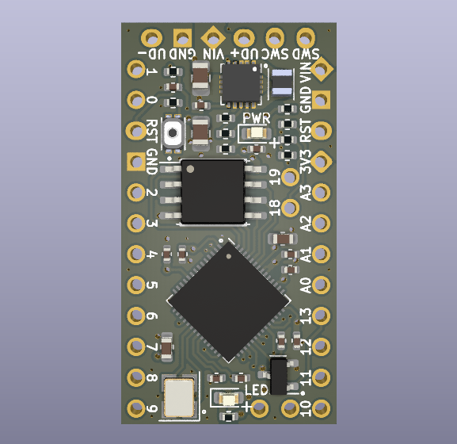
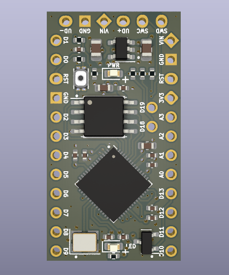
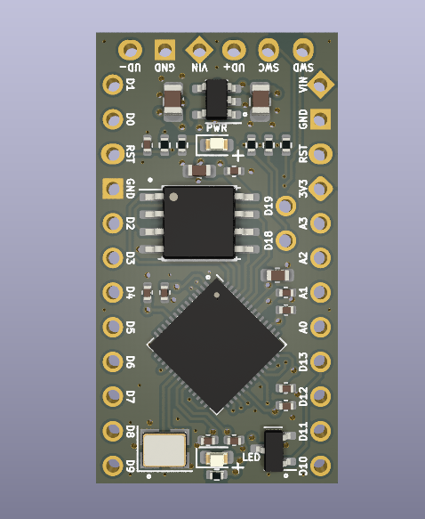
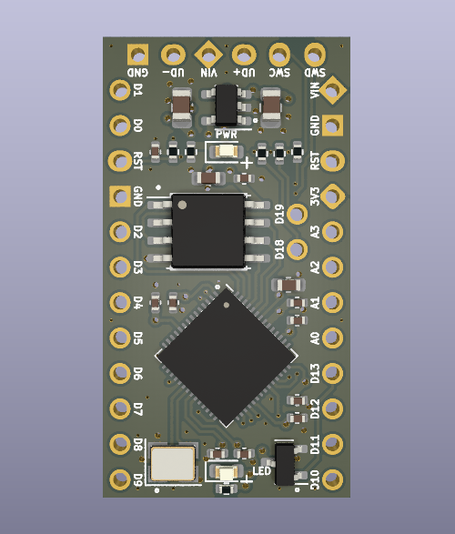

```
 ______    _______  _______  _______  _   ___  _______    _______  ______    _______         __   __  ___   __    _  ___  
|    _ |  |       ||       ||  _    || | |   ||  _    |  |       ||    _ |  |       |       |  |_|  ||   | |  |  | ||   |
|   | ||  |    _  ||____   || | |   || |_|   || | |   |  |    _  ||   | ||  |   _   | ____  |       ||   | |   |_| ||   |
|   |_||_ |   |_| | ____|  || | |   ||       || | |   |  |   |_| ||   |_||_ |  | |  ||____| |       ||   | |       ||   |
|    __  ||    ___|| ______|| |_|   ||___    || |_|   |  |    ___||    __  ||  |_|  |       |       ||   | |  _    ||   |
|   |  | ||   |    | |_____ |       |    |   ||       |  |   |    |   |  | ||       |       | ||_|| ||   | | | |   ||   |
|___|  |_||___|    |_______||_______|    |___||_______|  |___|    |___|  |_||_______|       |_|   |_||___| |_|  |__||___|
```

# RP2040-ProMini Project

The RP2040-ProMini project aims to create a replacement for the Arduino Pro Mini using the RP2040 MCU.

## RP2040-ProMini Board

The **RP2040-ProMini** board is a 4-layer board designed to accommodate the popular Raspberry Pi RP2040 MCU in the commonly used, but obsolete, Arduino Pro Mini footprint.

Preview:





You can view the [Schematics in PDF format](doc/RP2040-ProMini.pdf) for detailed information.

STEP 3D files are available [with pins](doc/RP2040-ProMini-with-pins.step) and [without pins](doc/RP2040-ProMini-board.step).

Features:

- Arduino Pro Mini compatible pinout
- Partially compatible with Arduino Nano RP2040 Connect pinout
- (v3.0) Detachable USB and JTAG extension board with RESET button
- Dual-core Cortex-M0+ Raspberry Pi RP2040
- Small footprint suitable for DIY projects
- (v1.0 - v1.1) 19 GPIO pins, including 4 analog inputs
- (v2.0 - v3.0) 21 GPIO pins, including 4 analog inputs
- USB data pins on the side connector
- SWD debugging pins on the side connector
- (v1.0 - v1.1) LDO-based 3.3V power supply with a maximum 16V input 
- (v2.0 - v3.0) Bock-Boost converter based 3.3V power supply with input range of 2.5V-12V
- Supports both SOIC and WSON flash packages
- Flat back side enables use as a sub-assembly
- Two cut points to reduce power consumption of unused components

CAM files, as well as the BOM and CPL files for JLCPCB, are available.

## Version History

### v3.0



- Added detachable USB and JTAG extension board with RESET button.

### v2.0



- Use Buck-Boost converter instead of LDO.
- Added two new digital pins.
- Moved few components around.

### v1.1



- Moved few components around.
- Added BOOTSEL mini button for programming convenience.
- Changed LED resistors to allow more current, making LED to emit more light.

### v1.0



- Moved few resistors around.
- Added small GND fill under the MCU.
- Switched positions of UD- and GND pins on the side connector.
- Generated different set of BOM and CPL files for SOIC and WSON versions of the board.

### v1.0b1



Initial release for testing purposes.

## Links

- [Raspberry Pi RP2040 information page](https://www.raspberrypi.com/documentation/microcontrollers/rp2040.html).
- [Arduino Pro Mini information page](https://docs.arduino.cc/retired/boards/arduino-pro-mini).
- [Arduino Nano RP2040 Connect page](https://docs.arduino.cc/hardware/nano-rp2040-connect).

## How to Help

Your contributions as code, resources, or finances are welcome! Please contact me directly via email at andriy.golovnya@gmail.com or through my [GitHub profile](https://github.com/red-scorp).

If you'd like to make a financial contribution, you can donate via [PayPal](http://paypal.me/redscorp) or [Ko-Fi](http://ko-fi.com/redscorp). Your support is greatly appreciated.

Thanks in advance!