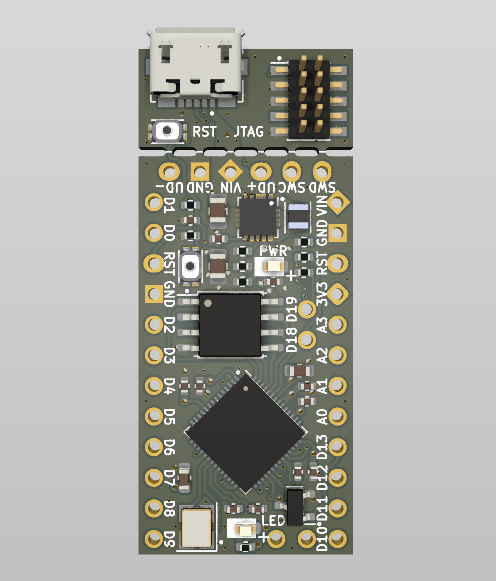
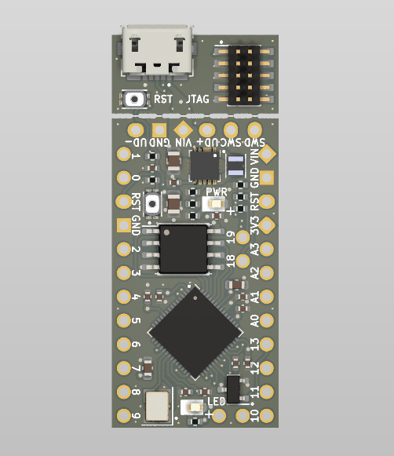
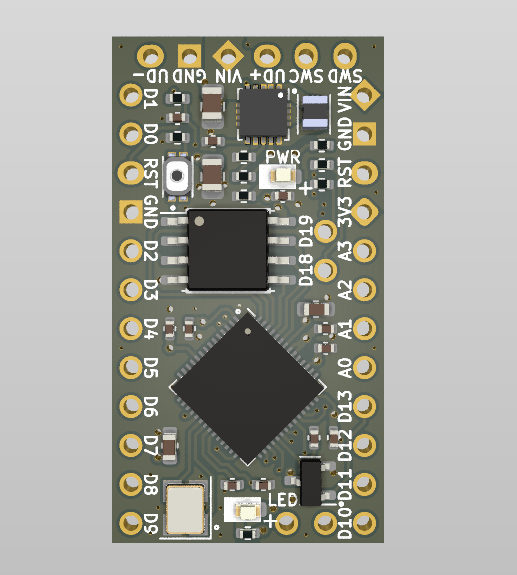
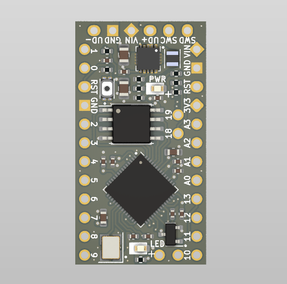
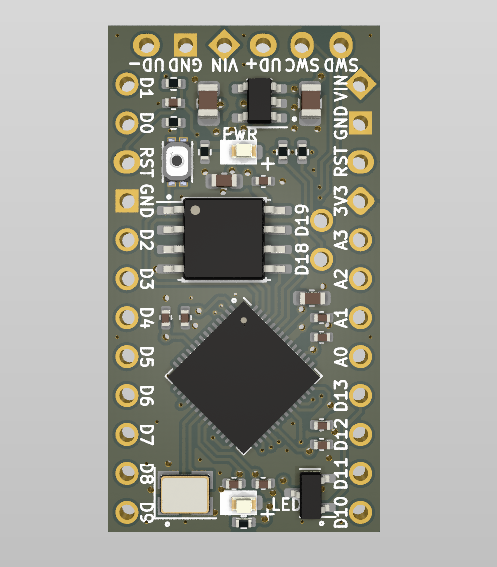
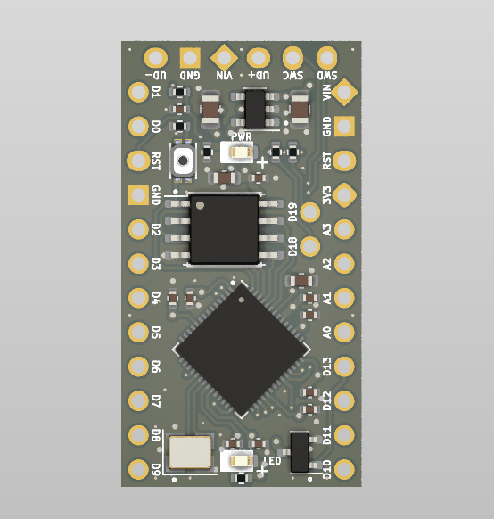

```
 ______  ______ ______   ______   __     ______     ______           ______  _       _ 
(_____ \(_____ (_____ \ / __   | / /    / __   |   (_____ \         |  ___ \(_)     (_)
 _____) )_____) )____) ) | //| |/ /____| | //| |___ _____) )___ ___ | | _ | |_ ____  _ 
(_____ (|  ____//_____/| |// | |___   _) |// | (___)  ____/ ___) _ \| || || | |  _ \| |
      | | |     _______|  /__| |   | | |  /__| |   | |   | |  | |_| | || || | | | | | |
      |_|_|    (_______)\_____/    |_|  \_____/    |_|   |_|   \___/|_||_||_|_|_| |_|_|
```

# RP2040-ProMini Project

The RP2040-ProMini project aims to create a replacement for the Arduino Pro Mini using the RP2040 MCU.

## RP2040-ProMini Board

The **RP2040-ProMini** board is a 4-layer board designed to accommodate the popular Raspberry Pi RP2040 MCU in the commonly used, but obsolete, Arduino Pro Mini footprint.

Preview:


You can view the [Schematics in PDF format](doc/RP2040-ProMini.pdf) for detailed information.

STEP 3D files are available [with pins](doc/RP2040-ProMini-with-pins.step) and [without pins](doc/RP2040-ProMini-board.step).

Features:

- Arduino Pro Mini compatible pinout
- Partially compatible with Arduino Nano RP2040 Connect pinout
- _(v3.x)_ Detachable USB and JTAG extension board with RESET button
- Dual-core Cortex-M0+ Raspberry Pi RP2040
- Small footprint suitable for DIY projects
- _(v1.x)_ 19 GPIO pins, including 4 analog inputs or _(v2.x-v3.x)_ 21 GPIO pins, including 4 analog inputs
- USB data pins on the side connector
- SWD debugging pins on the side connector
- _(v1.x)_ LDO-based 3.3V power supply with a maximum 16V input or _(v2.x-v3.x)_ Buck-Boost converter based 3.3V power supply with input range of 2.5V-12V
- Supports both SOIC and WSON 16MB flash packages
- Flat back side enables use as a sub-assembly
- Two cut points to reduce power consumption of unused components

CAM files, as well as the BOM and CPL files for JLCPCB, are available.

### Board Pinout

Following pinout is used for the board:

| Board Pin | RP2040 Pin | Function | Notes |
| --------- | ---------- | -------- | ----- |
| D0        | GPIO1      | UART0 TX |       |
| D1        | GPIO0      | UART0 RX |       |
| D2        | GPIO25     |          |       |
| D3        | GPIO15     |          |       |
| D4        | GPIO16     |          |       |
| D5        | GPIO17     |          |       |
| D6        | GPIO18     |          |       |
| D7        | GPIO19     |          |       |
| D8        | GPIO20     |          |       |
| D9        | GPIO21     |          |       |
| D10       | GPIO5      | SS       |       |
| D11       | GPIO7      | MOSI     |       |
| D12       | GPIO4      | MISO     |       |
| D13       | GPIO6      | SCK      | LED   |
| D14 A0    | GPIO26     |          |       |
| D15 A1    | GPIO27     |          |       |
| D16 A2    | GPIO28     |          |       |
| D17 A3    | GPIO29     |          |       |
| D18       | GPIO12     | SDA      |       |
| D19       | GPIO13     | SCL      |       |
| D20       | GPIO22     |          |       |
| D21       | GPIO23     |          |       |

### Cut Points

There are two cut points on the board to reduce power consumption of unused components.

| Cut Point | Function | Notes |
| --------- | -------- | ----- |
| CUT_VIN   | Separates VIN-to-3V3 power supply with power LED from the rest of the board | This cut point is useful if you want to power the board from 3V3 pin instead of VIN pin. |
| CUT_LED   | Separates LED on pin D13 from the rest of the board | This cut point is useful if you want to reduce power consumption of the board. |

## Version History

Roughly RP2040-ProMini board exists in three flavors:

- v1.x - this boards are cheaper because they are based on LDO power supply.
- v2.x - this boards are more expensive because they are based on Buck-Boost power supply.
- v3.x - this boards has same basic design as v2.x but includes detachable USB and JTAG extension board.

### v3.2 - xx.xx.2024



- Added Gxx pin names on the back of the board.
- Made extension board cut-out openings wider for easier cutting.

### v3.1 - 21.11.2023



- Removed pull-up resistor from SWCLK line.
- Added white silkscreen under LEDs to add light reflection.

### v3.0 - 29.08.2023


- Added detachable USB and JTAG extension board with RESET button.
- Improved routing a bit.

### v2.2 - 01.01.2024



- Added Gxx pin names on the back of the board.

### v2.1 - 21.11.2023



- Removed pull-up resistor from SWCLK line.
- Added white silkscreen under LEDs to add light reflection.

### v2.0 - 23.07.2023


- Use Buck-Boost converter instead of LDO.
- Added two new digital pins.
- Moved few components around.

### v1.3 - 01.01.2024



- Added Gxx pin names on the back of the board.
- Made front and back texts bigger for better readability.

### v1.2 - 21.11.2023



- Removed pull-up resistor from SWCLK line.
- Added white silkscreen under LEDs to add light reflection.

### v1.1 - 05.07.2023


- Moved few components around.
- Added BOOTSEL mini button for programming convenience.
- Changed LED resistors to allow more current, making LED to emit more light.

### v1.0 - 25.06.2023


- Moved few resistors around.
- Added small GND fill under the MCU.
- Switched positions of UD- and GND pins on the side connector.
- Generated different set of BOM and CPL files for SOIC and WSON versions of the board.

### v1.0b1 - 13.06.2023


Initial release for testing purposes.

## Links

- [Raspberry Pi RP2040 information page](https://www.raspberrypi.com/documentation/microcontrollers/rp2040.html).
- [Arduino Pro Mini information page](https://docs.arduino.cc/retired/boards/arduino-pro-mini).
- [Arduino Nano RP2040 Connect page](https://docs.arduino.cc/hardware/nano-rp2040-connect).
- [Arduino SDK for RP2040 board](https://github.com/earlephilhower/arduino-pico).

## How to Help

Your contributions as code, resources, or finances are welcome! Please contact me directly via email at andriy.golovnya@gmail.com or through my [GitHub profile](https://github.com/red-scorp).

If you'd like to make a financial contribution, you can donate via [PayPal](http://paypal.me/redscorp) or [Ko-Fi](http://ko-fi.com/redscorp). Your support is greatly appreciated.

Thanks in advance!
