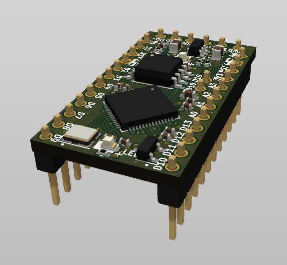

# RP2040-ProMini Project

The RP2040-ProMini project aims to create a replacement for the Arduino Pro Mini using the RP2040 MCU.

## RP2040-ProMini Board

The **RP2040-ProMini** board is a 4-layer board designed to accommodate the popular Raspberry Pi RP2040 MCU in the commonly used, but obsolete, Arduino Pro Mini footprint.

Preview:

You can view the [Schematics in PDF format](doc/RP2040-ProMini.pdf) for detailed information.

Features:

- Arduino Pro Mini compatible pinout
- Partially compatible with Arduino Nano RP2040 Connect pinout
- Dual-core Cortex-M0+ Raspberry Pi RP2040
- Small footprint suitable for DIY projects
- 19 GPIO pins, including 4 analog inputs
- USB data pins on the side connector
- SWD debugging pins on the side connector
- LDO-based 3.3V power supply with a maximum 16V input
- Supports both SOIC and WSON flash packages
- Flat back side enables use as a subassembly

CAM files, as well as the BOM and CPL files for JLCPCB, are available.

## Version History

### v1.0

Initial release

## Links

- [Paspberry Pi RP2040 information page](https://www.raspberrypi.com/documentation/microcontrollers/rp2040.html).
- [Arduino Pro Mini information page](https://docs.arduino.cc/retired/boards/arduino-pro-mini).
- [Arduino Nano RP2040 Connect page](https://docs.arduino.cc/hardware/nano-rp2040-connect).

## How to Help

Your contributions as code, resources, or finances are welcome! Please contact me directly via email at andriy.golovnya@gmail.com or through my [GitHub profile](https://github.com/red-scorp).

If you'd like to make a financial contribution, you can donate via [PayPal](http://paypal.me/redscorp) or [Ko-Fi](http://ko-fi.com/redscorp). Your support is greatly appreciated.

Thanks in advance!